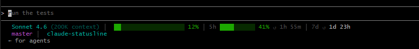
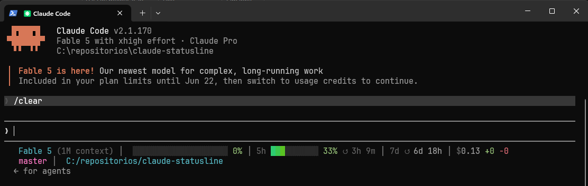

# claude-statusline

Status line minimalista para o [Claude Code](https://claude.ai/code) rodando no **Git Bash ou PowerShell no Windows** (e também no **WSL/Linux**).

Exibe modelo, uso do contexto, limite da sessão atual e limite semanal — tudo em uma linha, atualizado após cada resposta. Opcionalmente exibe a branch git atual e o nome da pasta em uma segunda linha.

> 📖 [Read in English](README.md)

---

## Preview

**Git Bash**


**PowerShell**


```
 Sonnet 4.6 (200K context) │  ███░░░░░░░░░░░░░░░░░ 16% │ 5h ██░░░░░░░░ 31% ↺ 2h 33m │ 7d ↺ 2d
 master │  meu-projeto
```

**Linha 1 — sempre visível:**

| Segmento | Descrição |
|----------|-----------|
| ` Sonnet 4.6` | Modelo atual |
| `(200K context)` | Tamanho do context window |
| `███░░░ 16%` | Barra de uso do contexto |
| `5h ██░░░ 31% ↺ 2h 33m` | Barra de uso da sessão de 5h + tempo para reset |
| `7d ↺ 2d` | Tempo para reset da sessão semanal |

**Linha 2 — opcional (`CLAUDE_STATUSLINE_GIT=1` ou `CLAUDE_STATUSLINE_PWD=1`):**

| Segmento | Descrição |
|----------|-----------|
| ` master` | Branch git atual (sufixo `*` se houver alterações não commitadas) — exige `CLAUDE_STATUSLINE_GIT=1` |
| ` meu-projeto` | Nome da pasta (padrão) ou caminho completo com `CLAUDE_STATUSLINE_PWD=1` |

**Cores:**
- 🟢 Verde — 0–69%
- 🟡 Amarelo — 70–89%
- 🔴 Vermelho — 90–100%

---

## Requisitos

| Ferramenta | Finalidade | Instalação |
|------------|------------|------------|
| [Git Bash](https://git-scm.com/downloads) | Shell de execução | Incluído no Git for Windows |
| [jq](https://jqlang.github.io/jq/) | Parsing de JSON | `winget install jqlang.jq` |
| [CaskaydiaCove NF](https://www.nerdfonts.com/) *(opcional)* | Ícones Nerd Font | Veja [Configuração de Fonte](#configuração-de-fonte-opcional) |

> **Usando PowerShell?** O Claude Code executa o status line via `bash`, então o **Git Bash é necessário mesmo ao iniciar o Claude Code pelo PowerShell**. O instalador PowerShell (`install.ps1`) apenas copia o script e configura o `settings.json` — o script em si sempre roda no `bash`.

---

## Instalação

**1. Clone o repositório:**
```bash
git clone https://github.com/khalleb/claude-statusline.git
cd claude-statusline
```

**2. Execute o instalador** — escolha o adequado ao seu shell:

**Git Bash / WSL / Linux:**
```bash
bash install.sh
```

**PowerShell (Windows):**
```powershell
powershell -ExecutionPolicy Bypass -File .\install.ps1
```

Os dois instaladores fazem a mesma coisa:
- Verificar se o `jq` está disponível
- Copiar `statusline.sh` para `~/.claude/statusline.sh`
- Oferecer para atualizar o `~/.claude/settings.json` automaticamente

**3. Adicione `statusLine` ao `~/.claude/settings.json`** (caso não tenha sido feito automaticamente):
```json
{
  "statusLine": {
    "type": "command",
    "command": "~/.claude/statusline.sh",
    "timeout": 10
  }
}
```

**4. Reinicie o Claude Code.**

---

## Configuração de Fonte (opcional)

Para ícones Nerd Font, instale a **CaskaydiaCove NF**:

```powershell
# Baixar e instalar (execute no PowerShell)
$url = "https://github.com/ryanoasis/nerd-fonts/releases/download/v3.2.1/CascadiaCode.zip"
$zip = "$env:TEMP\CascadiaCode-NF.zip"
$out = "$env:TEMP\CascadiaCode-NF"
Invoke-WebRequest -Uri $url -OutFile $zip -UseBasicParsing
Expand-Archive -Path $zip -DestinationPath $out -Force
$fontsDir = "$env:LOCALAPPDATA\Microsoft\Windows\Fonts"
New-Item -ItemType Directory -Force -Path $fontsDir | Out-Null
Get-ChildItem "$out\*.ttf" | ForEach-Object {
    Copy-Item $_.FullName -Destination $fontsDir -Force
    New-ItemProperty -Path "HKCU:\SOFTWARE\Microsoft\Windows NT\CurrentVersion\Fonts" `
        -Name "$($_.BaseName) (TrueType)" -Value "$fontsDir\$($_.Name)" -PropertyType String -Force | Out-Null
}
```

Configure a fonte no **Windows Terminal** (`settings.json`):
```json
"profiles": {
  "defaults": {
    "font": { "face": "CaskaydiaCove NF", "size": 11 }
  }
}
```

Ative o modo Nerd Font — adicione ao `~/.claude/settings.json` (funciona em qualquer shell):
```json
{
  "env": {
    "CLAUDE_STATUSLINE_NERDFONT": "1"
  }
}
```

---

## Variáveis de Ambiente

A forma recomendada é definir as variáveis no `~/.claude/settings.json` na chave `env` — funciona independente do shell (Git Bash, PowerShell, etc.) usado para iniciar o Claude Code:

```json
{
  "env": {
    "CLAUDE_STATUSLINE_NERDFONT": "1",
    "CLAUDE_STATUSLINE_GIT": "1"
  }
}
```

> **Por que não usar `~/.bashrc`?** Variáveis no `~/.bashrc` só são carregadas pelo Git Bash. Se você iniciar o Claude Code pelo PowerShell ou outro shell, elas não estarão disponíveis e recursos como a linha 2 não aparecerão.

| Variável | Valor | Efeito |
|----------|-------|--------|
| `CLAUDE_STATUSLINE_NERDFONT` | `1` | Ativa ícones Nerd Font (requer CaskaydiaCove NF ou JetBrainsMono NF) |
| `CLAUDE_STATUSLINE_GIT` | `1` | Linha 2: branch git + nome da pasta |
| `CLAUDE_STATUSLINE_PWD` | `1` | Linha 2: caminho completo no lugar do nome da pasta (`$HOME` exibido como `~`) |
| `CLAUDE_STATUSLINE_COST` | `1` | Linha 1: custo da sessão (`$X.XX`) + linhas adicionadas/removidas (`+N -N`) |
| `CLAUDE_STATUSLINE_ASCII` | `1` | Força modo ASCII puro (sem Unicode, sem cores) |
| `CLAUDE_STATUSLINE_DEBUG` | `1` | Grava o JSON em `/tmp/claude-sl-debug.json` para inspeção |

O `output_style.name` é exibido automaticamente na linha 1 quando definido e diferente de `"default"`. Nenhuma variável extra necessária.

---

## Como Funciona

O Claude Code chama o `statusline.sh` após cada resposta, enviando o estado da sessão como JSON via stdin. O script:

1. Lê o JSON com uma **única chamada ao `jq`** (< 5ms)
2. Constrói barras de progresso com gradiente true-color
3. Calcula os tempos de reset a partir dos timestamps Unix `resets_at`
4. Imprime duas linhas — o Claude Code exibe na área de status

### Campos JSON utilizados

```
model.display_name
context_window.used_percentage
context_window.context_window_size
rate_limits.five_hour.used_percentage
rate_limits.five_hour.resets_at         ← Unix timestamp (segundos)
rate_limits.seven_day.used_percentage
rate_limits.seven_day.resets_at         ← Unix timestamp (segundos)
worktree.branch                         ← usado pelo CLAUDE_STATUSLINE_GIT (fallback para git command)
workspace.current_dir                   ← usado pelo CLAUDE_STATUSLINE_GIT / CLAUDE_STATUSLINE_PWD
cost.total_cost_usd                     ← usado pelo CLAUDE_STATUSLINE_COST
cost.total_lines_added                  ← usado pelo CLAUDE_STATUSLINE_COST
cost.total_lines_removed                ← usado pelo CLAUDE_STATUSLINE_COST
output_style.name                       ← exibido na linha 1 automaticamente quando não for "default"
```

> **Obs.:** Os dados de rate limit (`5h` / `7d`) só estão disponíveis nos planos Claude Pro e Max. O status line oculta esses segmentos automaticamente quando não disponíveis. Os campos `cost.*` e `output_style.name` assumem valor `0`/vazio quando ausentes, então esses segmentos degradam sem erros.

---

## Testes

```bash
bash test-mock.sh
```

Executa os cenários: normal, aviso (75%), perigo (92%), sem rate limits, sessão nova, output style, custo de sessão e linha 2 com branch.

---

## Estrutura do Projeto

```
claude-statusline/
├── statusline.sh      # Script principal — chamado pelo Claude Code a cada resposta
├── install.sh         # Instalador (Git Bash / WSL / Linux)
├── install.ps1        # Instalador (PowerShell no Windows)
├── test-mock.sh       # Suite de testes com payloads JSON simulados
├── CLAUDE.md          # Contexto para o Claude Code ao trabalhar neste repositório
├── README.md          # Documentação em inglês
└── README.pt-BR.md    # Documentação em português
```

---

## Diferenças do Projeto Original

Este projeto é inspirado no [claude-code-statusline](https://github.com/KCChien/claude-code-statusline) de KC Chien. Diferenças principais:

| Funcionalidade | Original | Este projeto |
|----------------|----------|--------------|
| Plataforma | macOS | **Git Bash / PowerShell (Windows) e WSL/Linux** |
| Comando `stat` | BSD (`-f %m`) | GNU (`-c %Y`) |
| CRLF | Não necessário | `tr -d '\r'` no output do jq |
| Detecção true-color | `COLORTERM` | `COLORTERM` + `WT_SESSION` |
| Paths Windows | Não suportado | Converte `C:\caminho` → `/c/caminho` |
| Tempo de reset | Não implementado | Timestamp Unix `resets_at` |
| Layout | 2 linhas | **1 linha + 2ª linha opcional** |

---

## Licença

MIT — veja [LICENSE](LICENSE).

Inspirado em [claude-code-statusline](https://github.com/KCChien/claude-code-statusline) © KC Chien.
